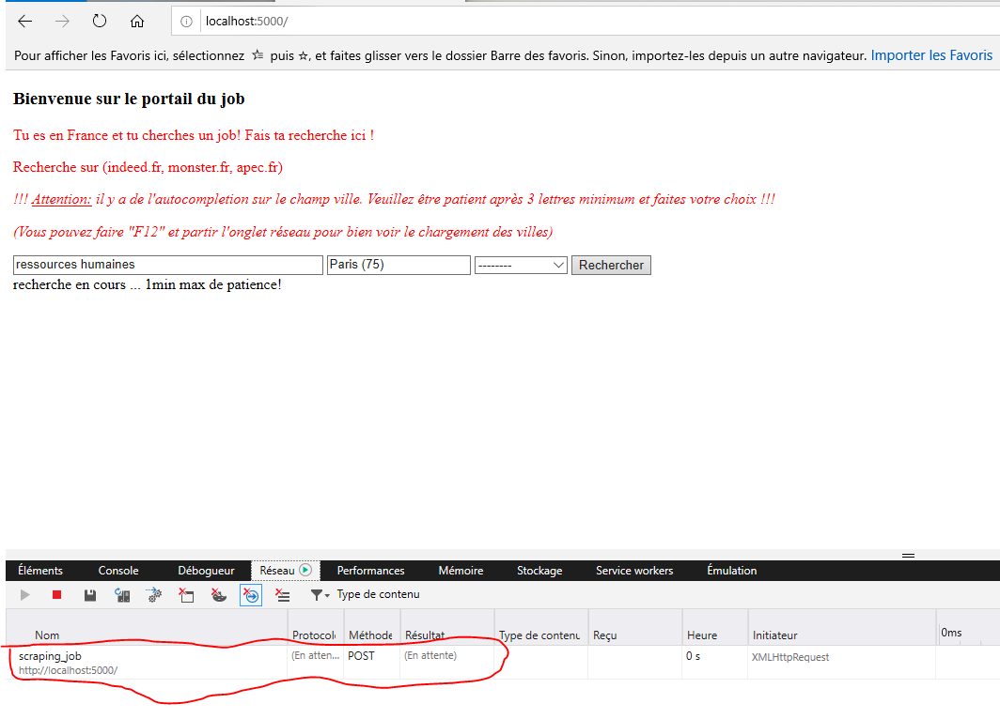

# Overview

Scraping jobs allow to extract job offers from majors job boards (currently, indeed.fr, apec.fr, monster.fr), display the results in the interface. More importantly, it provides on top of the collected data a simple and unified job search.

You can easily search for jobs using only key parameters, including: 
- the title of the job you are looking for,
- the name of city (in France) and the code of the department in which the city is located with autocompletion functionality,
- the type of contract you want.

## Benefits 

* Make it easier to find a job.

* Gather information from several sites.

* Provide an interface.

## Getting Started

These instructions will get you a copy of the project up and running on your local machine for development and testing purposes. See deployment for notes on how to deploy the project on a live system.

### Prerequisites

* Windows 7+ or Linux kernel version 3.10 or higher
* 2.00 GB of RAM
* 3.00 GB of available disk space

Use with Docker http://www.docker.io

### Installation

Pull Docker image on your computer and run:
```
docker pull atchopba/jobs-web-cli

docker run -d -p 5000:5000 --name jobs-web-cli atchopba/jobs-web-cli
```

Go to your web browser: http://localhost:5000/

#### Screenshots
1. When lauching page in your web browser. 


2. When you type 4 letters, the code goes to a json file for the city => You ought to wait 6-11s. That's what justifies the search time. 


3. Then, many propositions display. Choose one.


4. When you validate your search, the code goes looking for jobs on apec.fr/Indeed.fr/monster.fr by using a web service based on scraping-jobs. So you have to wait for the search to be done. You ought to wait at least 55s-1min.



5. Finally, you got the search results.


## License & copyright

This project is licensed under the GNU GENERAL PUBLIC LICENSE - see the [LICENSE.md](LICENSE.md) file for details
